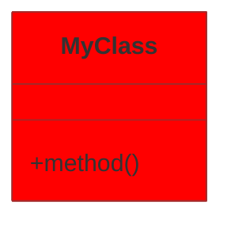

# 📊 INDEX DES DIAGRAMMES UML - PROJET MODÉLISATION

## 🎯 **Vue d'ensemble**

Ce projet implémente **6 Design Patterns** principaux avec leurs diagrammes UML correspondants.

## 📁 **Fichiers de diagrammes disponibles**

### **1. 🏭 Factory Pattern**
- **Fichier** : `UML_Diagrams_Factory_Pattern.md`
- **Description** : Création de formes géométriques 2D et 3D
- **Classes principales** : ShapeFactory, AbstractShapeFactory, Factory2D, Factory3D

### **2. 🎯 Strategy Pattern - Logging**
- **Fichier** : `UML_Diagrams_Strategy_Logging.md`
- **Description** : Système de logging avec différentes stratégies
- **Classes principales** : LoggingStrategy, ConsoleLogger, FileLogger, DatabaseLoggingStrategy

### **3. 🎯 Strategy Pattern - Algorithmes**
- **Fichier** : `UML_Diagrams_Strategy_Algorithms.md`
- **Description** : Algorithmes de plus court chemin (Dijkstra, BFS)
- **Classes principales** : ShortestPathStrategy, DijkstraAlgorithm, BFSAlgorithm

### **4. 👁️ Observer Pattern**
- **Fichier** : `UML_Diagrams_Observer_Pattern.md`
- **Description** : Notifications de changements Model-View
- **Classes principales** : Drawing (Observable), DrawingCanvas (Observer)

### **5. 🏠 Singleton Pattern**
- **Fichier** : `UML_Diagrams_Singleton_Pattern.md`
- **Description** : Gestionnaires uniques (Database, Config)
- **Classes principales** : DatabaseManager, DatabaseConfig

### **6. 🏗️ MVC Pattern**
- **Fichier** : `UML_Diagrams_MVC_Pattern.md`
- **Description** : Architecture générale Model-View-Controller
- **Classes principales** : Drawing (Model), MainView (View), DrawingController (Controller)

## 🛠️ **Comment utiliser ces diagrammes**

### **📋 Méthode 1 : Éditeur avec support Mermaid**
1. Ouvrez un fichier `.md` dans VS Code
2. Installez l'extension "Mermaid Preview"
3. Visualisez le diagramme directement

### **🌐 Méthode 2 : Outil en ligne**
1. Allez sur [mermaid.live](https://mermaid.live)
2. Copiez le code Mermaid depuis un fichier
3. Collez-le dans l'éditeur en ligne
4. Exportez en PNG/SVG/PDF

### **📱 Méthode 3 : GitHub/GitLab**
1. Uploadez les fichiers `.md` sur GitHub/GitLab
2. Les diagrammes s'affichent automatiquement
3. Mode clair/sombre disponible

### **🖥️ Méthode 4 : Logiciels UML**
1. Importez le code Mermaid dans :
   - Draw.io (diagrams.net)
   - Lucidchart
   - PlantUML
   - Visio (avec plugin)

## 📊 **Statistiques du projet**

- **Total Design Patterns** : 6
- **Total Classes** : 40+
- **Total Fichiers** : 60+
- **Architecture** : MVC avec patterns avancés

## 🎨 **Personnalisation**

Pour modifier l'apparence des diagrammes, ajoutez des directives Mermaid :

## 📝 **Notes importantes**

- Tous les diagrammes sont en **mode clair** par défaut
- Compatible avec **GitHub Flavored Markdown**
- Exportable en **PNG, SVG, PDF**
- **Zoom et pan** disponibles dans la plupart des viewers

## 🔗 **Liens utiles**

- [Documentation Mermaid](https://mermaid-js.github.io/mermaid/)
- [Éditeur en ligne](https://mermaid.live)
- [Extension VS Code](https://marketplace.visualstudio.com/items?itemName=bierner.markdown-mermaid)
- [GitHub Mermaid Support](https://github.blog/2022-02-14-include-diagrams-markdown-files-mermaid/)

---

**Créé pour le projet de modélisation JavaFX** 🎯
