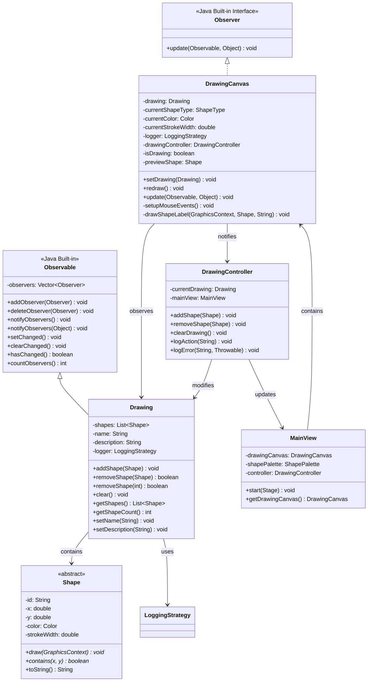

# Observer Pattern - Notifications de Changements - Diagramme UML

## Description
Ce diagramme montre l'implémentation du Observer Pattern pour les notifications de changements entre le modèle Drawing et la vue DrawingCanvas.

## Diagramme Mermaid

## Notes
- **Drawing** notifie les observateurs lors de :
  - SHAPE_ADDED
  - SHAPE_REMOVED  
  - DRAWING_CLEARED

- **DrawingCanvas** réagit aux notifications :
  - Redessine le canvas
  - Met à jour l'affichage
  - Gère les événements souris

## Utilisation
- Copiez le code Mermaid ci-dessus
- Collez-le dans un éditeur supportant Mermaid (VS Code, GitHub, GitLab, etc.)
- Ou utilisez un outil en ligne comme mermaid.live
