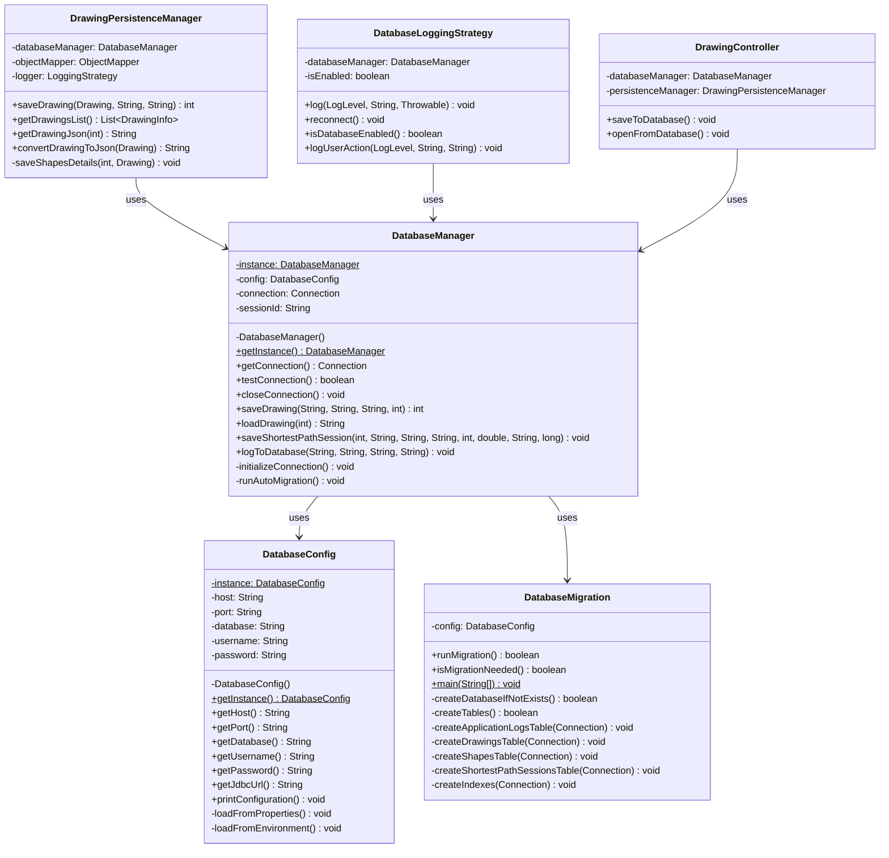

# Singleton Pattern - Gestionnaire de Base de Données - Diagramme UML

## Description
Ce diagramme montre l'implémentation du Singleton Pattern pour les gestionnaires de base de données et de configuration.

## Diagramme Mermaid

## Notes
- **DatabaseManager** : Singleton Pattern
  - Instance unique
  - Accès global
  - Initialisation paresseuse
  - Thread-safe avec synchronized

- **DatabaseConfig** : Singleton Pattern
  - Configuration unique
  - Chargement depuis properties
  - Variables d'environnement

## Utilisation
- Copiez le code Mermaid ci-dessus
- Collez-le dans un éditeur supportant Mermaid (VS Code, GitHub, GitLab, etc.)
- Ou utilisez un outil en ligne comme mermaid.live
