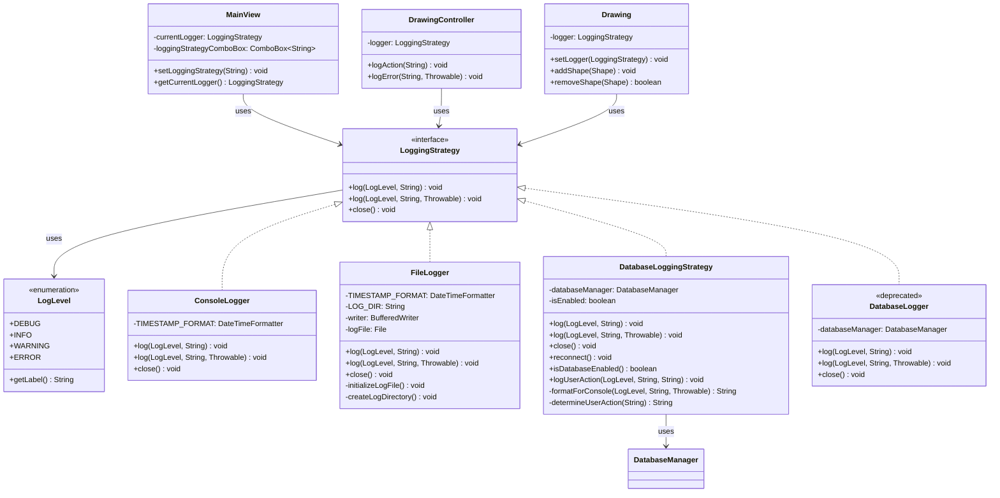

# Strategy Pattern - Système de Logging - Diagramme UML

## Description
Ce diagramme montre l'implémentation du Strategy Pattern pour le système de logging avec différentes stratégies (Console, Fichier, Base de données).

## Diagramme Mermaid

## Utilisation
- Copiez le code Mermaid ci-dessus
- Collez-le dans un éditeur supportant Mermaid (VS Code, GitHub, GitLab, etc.)
- Ou utilisez un outil en ligne comme mermaid.live
